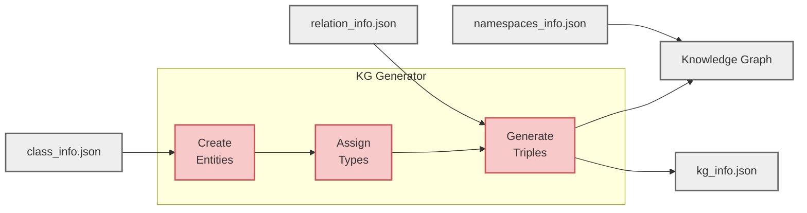

# KG Generation

KG generation creates synthetic Knowledge Graph instances from extracted ontology metadata. Entities are created, assigned types, and connected with triples that respect ontology constraints.

**On this page:**

- [Overview](#overview) - Understanding the generation pipeline
- [How Constraints Are Enforced](#how-constraints-are-enforced) - What rules PyGraft-gen respects
- [The Generation Pipeline](#the-generation-pipeline) - Four phases of generation
- [Configuration Parameters](#configuration-parameters) - Tuning generation behavior
- [Performance Characteristics](#performance-characteristics) - Runtime and memory expectations
- [FAQ](#faq) - Common questions and troubleshooting


## Overview

KG generation takes the three metadata files from [ontology extraction](ontology-extraction.md) and produces a Knowledge Graph:



**Output files:**

- :fontawesome-solid-project-diagram: `kg.{ttl|rdf|nt}` - The complete Knowledge Graph in your chosen RDF format
- :fontawesome-solid-chart-bar: `kg_info.json` - Statistics and parameters documenting what was generated

!!! warning "Extraction Scope"
    The generator can only enforce constraints from the extracted metadata but cannot enforce constructs that weren't capture during extraction.  

    :material-fire: See [What's Supported](../getting-started/quickstart.md/#whats-supported)

---

## PyGraft-gen's Improvements

??? info "Evolution from Original PyGraft"
    PyGraft-gen introduces two major advancements over the original PyGraft:

    **1. Ontology Extraction**  
    Generate KGs from real-world ontologies instead of only synthetic schemas. Extract structure from existing [OWL](https://www.w3.org/TR/owl2-overview/){target="_blank" rel="noopener"}/[RDFS](https://www.w3.org/TR/rdf-schema/){target="_blank" rel="noopener"} ontologies and use it as the foundation for generation.

    **2. Optimized KG Generator for Large-Scale Generation**  
    A completely redesigned architecture enabling generation at scales previously impractical (1M+ entities, 10M+ triples).

    ### Legacy PyGraft Limitations

    The original PyGraft generator faced fundamental bottlenecks at scale:

    - **String-based identifiers:** All entities, classes, and relations stored as Python strings throughout generation. This created substantial memory overhead and required string hashing for every lookup.

    - **Generate-then-filter workflow:** Triples were generated first, then cleaned up in separate filter passes. Each filter scanned the entire triple set, resulting in millions of redundant examinations for large KGs.

    - **Sequential one-at-a-time sampling:** Each triple sampled and validated individually. Functional property checks required scanning all existing triples per attempt, creating $O(n_{\text{triples}})$ cost per sample.

    For a 10M triple KG, this approach meant 10M+ individual sampling operations with millions of full triple set scans.

    ### PyGraft-gen's Optimized Design

    PyGraft-gen uses an **integer-ID model with batch sampling and two-phase filtering**:

    - **Integer-based identifiers:** Entities, classes, and relations use integer IDs internally. Strings only appear during serialization. This eliminates string overhead and enables efficient NumPy array operations.

    - **Pre-computed constraint caches:** Domain/range pools, disjointness sets, and property characteristics computed once before generation. No repeated set intersections or dictionary lookups during sampling.

    - **Batch sampling with vectorized filtering:** Sample large batches of candidate triples, then apply constraints in two phases:
        - **Fast filtering**: Vectorized NumPy operations eliminate invalid candidates before generation (irreflexive, duplicates, functional constraints) - checks that don't depend on graph state
        - **Deep validation**: Per-triple checks during generation as each triple is added - validates against the evolving graph state (domain/range typing, disjointness, transitive cycles)

    - **Incremental constraint tracking:** Functional and inverse-functional properties maintain sets of used heads/tails. Constraint checks become $O(1)$ set membership tests instead of $O(n_{\text{triples}})$ scans.

    **Adaptive mechanisms:**

    - Oversample multiplier for constrained relations
    - Stall detection drops unproductive relations
    - Tail phase timeout prevents infinite loops
    - Dynamic weight recomputation maintains distribution

    **Performance impact:**

    - Legacy: 10M triples = 10M sampling operations with $O(n_{\text{triples}})$ validation each
    - PyGraft-gen: 10M triples = ~1,000 batch operations with $O(1)$ constraint checks
    - Result: Hours reduced to minutes for large-scale generation

---

## How Constraints Are Enforced

The generator enforces constraints extracted from the ontology during generation. Every triple generated satisfies the schema's explicit constraints.

!!! tip "Detailed Explanations"
    For detailed explanations with examples, see [OWL Constraints](owl-constraints.md).

### Enforced Constraints

**Class Constraints:**

| Constraint                                                                                              | Property           | Enforcement                         |
|---------------------------------------------------------------------------------------------------------|--------------------|-------------------------------------|
| [**Hierarchy**](https://www.w3.org/TR/rdf-schema/#ch_subclassof){target="_blank" rel="noopener"}        | `rdfs:subClassOf`  | Entities inherit all superclasses   |
| [**Disjointness**](https://www.w3.org/TR/owl2-syntax/#Disjoint_Classes){target="_blank" rel="noopener"} | `owl:disjointWith` | Entities cannot have disjoint types |

**Property Characteristics:**

| Constraint                                                                                                                        | Property                        | Enforcement                               |
|-----------------------------------------------------------------------------------------------------------------------------------|---------------------------------|-------------------------------------------|
| [**Functional**](https://www.w3.org/TR/owl2-syntax/#Functional_Object_Properties){target="_blank" rel="noopener"}                 | `owl:FunctionalProperty`        | At most one outgoing edge per subject     |
| [**Inverse functional**](https://www.w3.org/TR/owl2-syntax/#Inverse-Functional_Object_Properties){target="_blank" rel="noopener"} | `owl:InverseFunctionalProperty` | At most one incoming edge per object      |
| [**Symmetric**](https://www.w3.org/TR/owl2-syntax/#Symmetric_Object_Properties){target="_blank" rel="noopener"}                   | `owl:SymmetricProperty`         | Stores only one direction per entity pair |
| [**Asymmetric**](https://www.w3.org/TR/owl2-syntax/#Asymmetric_Object_Properties){target="_blank" rel="noopener"}                 | `owl:AsymmetricProperty`        | Rejects if reverse edge exists            |
| [**Transitive**](https://www.w3.org/TR/owl2-syntax/#Transitive_Object_Properties){target="_blank" rel="noopener"}                 | `owl:TransitiveProperty`        | Prevents cycles with irreflexive closure  |
| [**Irreflexive**](https://www.w3.org/TR/owl2-syntax/#Irreflexive_Object_Properties){target="_blank" rel="noopener"}               | `owl:IrreflexiveProperty`       | No self-loops                             |
| [**Reflexive**](https://www.w3.org/TR/owl2-syntax/#Reflexive_Object_Properties){target="_blank" rel="noopener"}                   | `owl:ReflexiveProperty`         | Not materialized (reasoners infer)        |

**Relational Constraints:**

| Constraint                                                                                                                 | Property                     | Enforcement                                |
|----------------------------------------------------------------------------------------------------------------------------|------------------------------|--------------------------------------------|
| [**Domain/range**](https://www.w3.org/TR/rdf-schema/#ch_range){target="_blank" rel="noopener"}                             | `rdfs:domain` / `rdfs:range` | Triples respect class restrictions         |
| [**Property disjointness**](https://www.w3.org/TR/owl2-syntax/#Disjoint_Object_Properties){target="_blank" rel="noopener"} | `owl:propertyDisjointWith`   | Entity pairs cannot use disjoint relations |
| [**Inverse relationships**](https://www.w3.org/TR/owl2-syntax/#Inverse_Object_Properties){target="_blank" rel="noopener"}  | `owl:inverseOf`              | Validates inverse triples would be valid   |
| [**Subproperty inheritance**](https://www.w3.org/TR/rdf-schema/#ch_subpropertyof){target="_blank" rel="noopener"}          | `rdfs:subPropertyOf`         | Constraints inherited from superproperties |

### Forbidden Characteristic Combinations

Some characteristic combinations are logically inconsistent and prohibited by [OWL 2](https://www.w3.org/TR/owl2-overview/){target="_blank" rel="noopener"}:

**:fontawesome-solid-circle-xmark: Direct Contradictions (Generation Stops):**

| Combination                                                                                                                                                                                                                           | Why Forbidden                                           |
|---------------------------------------------------------------------------------------------------------------------------------------------------------------------------------------------------------------------------------------|---------------------------------------------------------|
| [**Reflexive**](https://www.w3.org/TR/owl2-syntax/#Reflexive_Object_Properties){target="_blank" rel="noopener"} + [**Irreflexive**](https://www.w3.org/TR/owl2-syntax/#Irreflexive_Object_Properties){target="_blank" rel="noopener"} | Reflexive requires self-loops; Irreflexive forbids them |
| [**Symmetric**](https://www.w3.org/TR/owl2-syntax/#Symmetric_Object_Properties){target="_blank" rel="noopener"} + [**Asymmetric**](https://www.w3.org/TR/owl2-syntax/#Asymmetric_Object_Properties){target="_blank" rel="noopener"}   | Symmetric requires bidirectional; Asymmetric forbids it |

**:fontawesome-solid-triangle-exclamation: Problematic Combinations (Warnings, Relation Excluded):**

| Combination                                                                                                                                                                                                                                          | Issue                                                                                                            |
|------------------------------------------------------------------------------------------------------------------------------------------------------------------------------------------------------------------------------------------------------|------------------------------------------------------------------------------------------------------------------|
| [**Asymmetric**](https://www.w3.org/TR/owl2-syntax/#Asymmetric_Object_Properties){target="_blank" rel="noopener"} + [**Functional**](https://www.w3.org/TR/owl2-syntax/#Functional_Object_Properties){target="_blank" rel="noopener"}                | Creates inconsistency in [OWL 2](https://www.w3.org/TR/owl2-overview/){target="_blank" rel="noopener"} reasoning |
| [**Asymmetric**](https://www.w3.org/TR/owl2-syntax/#Asymmetric_Object_Properties){target="_blank" rel="noopener"} + [**InverseFunctional**](https://www.w3.org/TR/owl2-syntax/#Inverse-Functional_Object_Properties){target="_blank" rel="noopener"} | Creates inconsistency in [OWL 2](https://www.w3.org/TR/owl2-overview/){target="_blank" rel="noopener"} reasoning |
| [**Transitive**](https://www.w3.org/TR/owl2-syntax/#Transitive_Object_Properties){target="_blank" rel="noopener"} + [**Functional**](https://www.w3.org/TR/owl2-syntax/#Functional_Object_Properties){target="_blank" rel="noopener"}                | Can lead to unintended inference chains and explosions                                                           |

When detected during schema loading, the generator either stops (SEVERE errors) or excludes the problematic relation (WARNING errors).

---

## The Generation Pipeline

Generation happens in four sequential phases, each building on the previous one.


### :fontawesome-solid-1: Schema Loading

The first phase prepares everything needed for efficient generation by converting metadata into optimized internal structures.

**:fontawesome-solid-fingerprint: ID mappings:**

Convert class/relation names to integer IDs and create bidirectional lookups (string &harr; ID). This enables fast array-based operations throughout generation.

**:fontawesome-solid-database: Constraint caches (pre-computed):**

All constraint data is computed once upfront to avoid repeated lookups during generation:

- Domain/range entity pools for each relation
- Disjoint envelopes (classes disjoint with each relation's domain/range)
- Transitive superclass closures for all classes
- Property characteristics sets (functional, symmetric, transitive, etc.)
- Inverse mappings and subproperty chains

**:fontawesome-solid-shield-halved: Schema validation:**

Checks for logical contradictions before generation begins:

- **SEVERE errors** stop generation immediately (e.g., reflexive + irreflexive, symmetric + asymmetric)
- **WARNING errors** exclude problematic relations (e.g., transitive + functional, asymmetric + functional)


### :fontawesome-solid-2: Entity Creation and Typing

With the schema loaded, entities are created and assigned types according to the class hierarchy.

**:fontawesome-solid-users: Entity creation:**

- Allocates entity ID space (E1, E2, ..., En)
- Splits entities into typed vs untyped based on `prop_untyped_entities`

**:fontawesome-solid-tags: Type assignment:**

Typed entities receive classes sampled from the hierarchy:

- Uses power-law distribution (mimics real-world data where a few classes are very common and most are rare)
- Target depth controlled by `avg_specific_class_depth`
- Transitive superclasses added automatically
- Optional multityping adds additional most-specific classes

**:fontawesome-solid-ban: Disjointness enforcement:**

If an entity receives disjoint classes, one is removed deterministically to maintain logical consistency.

**:fontawesome-solid-list: Reverse indices:**

Builds lookup tables for the next phase:

- `class2entities[Person] = [E1, E5, E12, ...]` - All entities of each class
- `class2unseen[Person] = [E5, E12, ...]` - Entities not yet used in triples

These enable fast candidate pool construction during triple generation.


### :fontawesome-solid-3: Triple Generation

The core phase where relational triples are created using batch sampling with constraint filtering.


#### Setup Phase (One-Time)

Before generating any triples, the system prepares relation-specific data:

**:fontawesome-solid-filter: Build candidate entity pools per relation:**

- Domain pool: Entities satisfying ALL domain classes (intersection)
- Range pool: Entities satisfying ALL range classes (intersection)
- Relations with empty pools are excluded from generation

**:fontawesome-solid-balance-scale: Distribute triple budget across relations:**

- Controlled by `relation_usage_uniformity`
- 0.0 = power-law distribution (few relations dominate)
- 1.0 = uniform distribution (all relations equal)

**:fontawesome-solid-clipboard-check: Initialize tracking structures:**

- Duplicate detection: `seen_pairs[relation] = {(h1,t1), (h2,t2), ...}`
- Functional heads: `functional_heads[relation] = {E1, E5, ...}`
- Inverse-functional tails: `invfunctional_tails[relation] = {E2, E8, ...}`

#### Generation Loop (Iterative)

Triples are generated in batches until the target count is reached:

1. :fontawesome-solid-dice: **Sample a relation** using weighted probabilities
2. :fontawesome-solid-users-between-lines: **Sample a batch of candidate entity pairs** from relation's pools
   - Biases toward unseen entities (from `class2unseen`) to encourage coverage
3. :fontawesome-solid-gauge-high: **Apply fast filtering** (vectorized constraint checks)
4. :fontawesome-solid-magnifying-glass: **Apply deep validation** (per-triple constraint checks)
5. :fontawesome-solid-check: **Accept valid triples** and update tracking structures
   - Remove used entities from `class2unseen` pools
6. :fontawesome-solid-arrows-rotate: **Adjust batch size** adaptively and drop stalled relations

#### Two-Phase Filtering

The generator applies constraints in two stages for efficiency:

??? info ":fontawesome-solid-gauge-high: Fast Filtering (Vectorized)"
    Applied to the entire batch before generation. These checks don't depend on graph state:
    
    - **Irreflexivity**: `head == tail`
    - **Duplicates**: `(head, tail)` already in `seen_pairs`
    - **Functional**: `head` already in `functional_heads`
    - **Inverse-functional**: `tail` already in `invfunctional_tails`
    - **Asymmetric**: reverse edge exists
    - **Symmetric duplicates**: reverse direction already generated

??? info ":fontawesome-solid-magnifying-glass: Deep Validation (Per-Triple)"
    Applied during generation as each triple is added. These checks require type information or graph traversal:
    
    - **Domain/range typing**: Entity types satisfy all constraints
    - **Disjoint envelopes**: Entities not instances of classes disjoint with domain/range
    - **Inverse validation**: Inverse triple would be valid
    - **Property disjointness**: Entity pair doesn't exist for disjoint property
    - **Transitive cycles**: No reflexive cycles created
    - **Subproperty inheritance**: Constraints from superproperties satisfied

#### Adaptive Mechanisms

The generator adjusts dynamically to maintain efficiency:

- **Oversample multiplier**: Constrained relations (functional, inverse-functional) oversample 4x to compensate for higher rejection rates
- **Batch sizing**: Increases dynamically as valid candidates become scarce
- **Stall detection**: Relations producing 20 consecutive empty batches are dropped (candidate pool exhausted)
- **Weight recomputation**: Redistributes budget from dropped relations to active ones

!!! info "Target vs Actual"
    `num_triples` is a target. Actual count may be lower due to constraint exhaustion and is reported in `kg_info.json`.


### :fontawesome-solid-4: Serialization

The final phase writes the generated Knowledge Graph to disk with proper formatting.

**:fontawesome-solid-project-diagram: RDF graph (`kg.ttl`, `.rdf`, or `.nt`):**

- Instance triples (head, relation, tail)
- Type assertions for **most-specific classes only** (reasoners infer superclasses)
- Namespace bindings from `namespaces_info.json`

**:fontawesome-solid-chart-bar: Statistics (`kg_info.json`):**

- User parameters (requested counts, configuration)
- Actual statistics (generated counts, averages, proportions)


---


## Configuration Parameters

Once you understand the generation pipeline, you can fine-tune it using the configuration parameters in the `kg` section of your [config file](../reference/files/config.md/#kg).


| Parameter                   | Controls                                                |
|-----------------------------|---------------------------------------------------------|
| `num_entities`              | Total entity count                                      |
| `num_triples`               | Target triple count                                     |
| `prop_untyped_entities`     | Proportion without class assignment (0.0-1.0)           |
| `avg_specific_class_depth`  | Target hierarchy depth for assigned classes             |
| `multityping`               | Allow multiple most-specific classes per entity         |
| `avg_types_per_entity`      | Target average class count when multityping enabled     |
| `relation_usage_uniformity` | Triple distribution evenness across relations (0.0-1.0) |
| `enable_fast_generation`    | Generate small prototype then scale up                  |
| `check_kg_consistency`      | Run reasoner validation after generation                |

!!! tip "Complete Reference"
    See [Configuration Reference](../reference/files/config.md) for detailed parameter descriptions.

### Key Parameters Explained

??? example "`relation_usage_uniformity` (0.0-1.0)"
    Controls triple distribution across relations. Example with 10 relations, 1000 triples:

    | uniformity | R1  | R2  | R3  | R4  | R5  | R6  | R7  | R8  | R9  | R10 |
    |------------|-----|-----|-----|-----|-----|-----|-----|-----|-----|-----|
    | 0.0        | 400 | 200 | 150 | 100 | 50  | 40  | 30  | 20  | 5   | 5   |
    | 0.5        | 180 | 150 | 130 | 110 | 95  | 85  | 75  | 65  | 60  | 50  |
    | 1.0        | 100 | 100 | 100 | 100 | 100 | 100 | 100 | 100 | 100 | 100 |

??? example "`avg_specific_class_depth`"
    Controls type specificity. Example hierarchy:
    ```
    owl:Thing (depth 0)
    ├── Person (depth 1)
    │   ├── Student (depth 2)
    │   │   └── GraduateStudent (depth 3)
    │   └── Professor (depth 2)
    └── Organization (depth 1)
    ```

    - depth 1.0 → Person, Organization
    - depth 2.0 → Student, Professor
    - depth 3.0 → GraduateStudent

??? example "`enable_fast_generation`"
    Generates a small prototype KG (10-20% of target), then replicates entity profiles to reach target size. Significantly faster for large KGs but produces less diverse entity typing patterns.


## Fast Generation Mode

For large-scale generation, fast mode offers a speed-optimized alternative to the standard pipeline.

When `enable_fast_generation: true`, the generator creates a small prototype KG then replicates entity profiles to reach target size.

!!! abstract "How It Works"
    Fast generation trades entity typing diversity for speed by reusing type profiles:

    1. :fontawesome-solid-seedling: **Generate seed batch** (10-20% of target size) with full constraint pipeline
    2. :fontawesome-solid-camera: **Capture entity type profiles** from seed batch
    3. :fontawesome-solid-copy: **Replicate profiles** round-robin to create remaining entities
       - Each new entity gets a copy of a seed entity's type assignments
       - Profiles are shuffled to maintain distribution
    4. :fontawesome-solid-link: **Generate triples** for all entities (seed + replicated)

!!! success "Benefits"
    - :fontawesome-solid-gauge-high: **Significantly faster** for large KGs (100K+ entities)
    - :fontawesome-solid-chart-pie: **Preserves type distribution** and hierarchy characteristics
    - :fontawesome-solid-forward: **Avoids recomputing** hierarchy sampling and disjointness resolution

!!! warning "Trade-offs"
    - :fontawesome-solid-clone: **Less diverse entity typing patterns** (profiles are copied, not unique)
    - :fontawesome-solid-equals: **Type distribution matches seed batch exactly**

!!! tip "When to Use"
    - Large KGs (1M+ entities) where full generation is slow
    - Heavily constrained schemas
    - Testing configurations before full-scale runs

---

## Performance Characteristics

Understanding performance helps you plan generation runs and troubleshoot issues.

### Time Complexity

Where $n_e$ = `num_entities`, $n_t$ = `num_triples`, $n_c$ = number of classes, $n_r$ = number of relations:

| Phase                                   | Complexity                        | Notes                                    |
|-----------------------------------------|-----------------------------------|------------------------------------------|
| :fontawesome-solid-1: Schema Loading    | $O(n_c + n_r)$                    | One-time setup                           |
| :fontawesome-solid-2: Entity Typing     | $O(n_e \times \log(n_c))$         | Power-law sampling + transitive closures |
| :fontawesome-solid-3: Triple Generation | $O(n_t \times \text{batch_size})$ | Fast filtering is vectorized             |
| :fontawesome-solid-4: Serialization     | $O(n_t + n_e)$                    | Linear in outputs                        |

??? info ":fontawesome-solid-gauge: Performance Factors"
    **What affects speed:**
    
    - Hardware (CPU, RAM)
    - Schema complexity (number of constraints, hierarchy depth)
    - Configuration (`relation_usage_uniformity`, `enable_fast_generation`)

??? example ":fontawesome-solid-clock: Relative Scale Expectations"
    - **Small** (1K-10K entities): Seconds
    - **Medium** (10K-100K entities): Minutes
    - **Large** (100K-1M entities): Tens of minutes
    - **Very large** (1M+ entities): Hours

??? warning ":material-speedometer-slow: What Slows Generation Down"
    - **Transitive cycle detection**: Requires graph traversal to prevent cycles ($O(\text{path_length})$ per check)
    - **Deep validation**: Each surviving candidate requires type checking and constraint validation against the current KG state
    - **Inverse relation validation**: Must validate both the requested triple and its inverse for compatibility
    - **Small candidate pools**: Heavily constrained schemas (tight domain/range, many functional properties, extensive disjointness) require more sampling attempts per accepted triple

---

### Memory Usage

Memory requirements scale with graph size and schema complexity.

**:fontawesome-solid-memory: Memory components:**

- Entity structures: $O(n_e)$
- Triple storage: $O(n_t)$
- Constraint caches: $O(n_c + n_r)$
- Candidate pools: $O(n_r \times \text{pool_size})$

??? info ":fontawesome-solid-chart-line: What Affects Memory"
    - Number of entities and triples (primary drivers)
    - Schema size (classes, relations, constraints)
    - Number of active relations being tracked
    - Whether consistency checking is enabled (reasoner memory overhead)

??? tip ":fontawesome-solid-download: Memory-Saving Strategies"
    **During generation:**
    
    - Use fast generation mode for large KGs
    - Reduce `relation_usage_uniformity` (smaller pool tracking)
    
    **Post-generation:**
    
    Consistency checking runs as a separate step after the KG is serialized. It uses the [HermiT](http://www.hermit-reasoner.com/){target="_blank" rel="noopener"} reasoner via [Owlready2](https://owlready2.readthedocs.io/){target="_blank" rel="noopener"} which:

    - Runs in its own JVM subprocess with independent memory
    - Can be extremely memory-intensive on large KGs
    - May exhaust Java heap space on very large graphs
    
    For large KGs (1M+ entities), disable `check_kg_consistency` to avoid memory issues and long validation times. See [Consistency Checking](consistency-checking.md) for details.

---

### Constraint Impact on Performance

Some constraints are more expensive to validate than others:

| Constraint Type                                             | Cost   | Notes                                             |
|-------------------------------------------------------------|--------|---------------------------------------------------|
| :fontawesome-solid-circle-check: Irreflexive                | Low    | $O(1)$ check (head == tail)                       |
| :fontawesome-solid-circle-check: Functional                 | Low    | $O(1)$ set lookup                                 |
| :fontawesome-solid-circle-check: Inverse-functional         | Low    | $O(1)$ set lookup                                 |
| :fontawesome-solid-circle-check: Domain/Range               | Low    | $O(1)$ set membership (pre-filtered pools)        |
| :fontawesome-solid-circle-check: Symmetric                  | Low    | $O(1)$ duplicate check                            |
| :fontawesome-solid-circle-half-stroke: Asymmetric           | Medium | $O(1)$ reverse edge check                         |
| :fontawesome-solid-circle-half-stroke: Disjointness         | Medium | $O(\text{disjoint_set_size})$ intersection checks |
| :fontawesome-solid-circle-half-stroke: Inverse validation   | Medium | $O(1)$ + validation of inverse triple             |
| :fontawesome-solid-circle-xmark: Transitive cycle detection | High   | $O(\text{path_length})$ graph traversal           |

---


## FAQ

Here are answers to common questions and troubleshooting tips based on generation behavior.

??? question "Why did I get fewer triples than I requested?"
    Constraints are too restrictive (small domain/range pools, many functional properties) or relations exhausted their candidate space early and were dropped.

??? question "Why is generation taking hours?"
    Expensive constraints (transitive properties, deep subproperty hierarchies, complex inverse validations) or small candidate pools slow down validation.

??? question "Why are many relations excluded or dropped?"
    Empty candidate pools (domain/range constraints have no satisfying entities) or forbidden characteristic combinations (Asymmetric + Functional, Transitive + Functional). Check logs for specific exclusion reasons.

---

## Limitations

The generator enforces only constraints captured during [Ontology extraction](./ontology-extraction.md). This creates some important limitations to be aware of like some unsupported OWL constructs not being enforced during generation but being validated during consistency checking.

This creates a **generation vs validation gap**: A KG can be generated "correctly" according to extracted metadata but still fail consistency checking against the full ontology.

**Why this matters:**

- Generated KG respects extracted constraints
- Consistency checking validates against full ontology (including unsupported constructs)
- Result: KG may be marked inconsistent due to constraints not enforced during generation

!!! tip "Learn More"
    See [Consistency Checking](consistency-checking.md) for details on this gap and [What's Supported](../getting-started/quickstart.md/#whats-supported) for unsupported constructs.

---

## What's Next

- :fontawesome-solid-shield-halved: **[OWL Constraints](owl-constraints.md)** - Detailed constraint explanations
- :fontawesome-solid-check-circle: **[Consistency Checking](consistency-checking.md)** - Validating generated KGs
- :fontawesome-solid-sliders: **[Configuration Reference](../reference/files/config.md)** - All generation parameters
- :fontawesome-solid-chart-simple: **[KG Info Reference](../reference/files/kg-info.md)** - Output statistics format
